# Download Workflows from BioDepot-LLC Repository

- Use the Git command to clone the repository https://github.com/Biodepot-LLC/workflows
- Download the compressed file and then unzip the workflows.

On the menu bar, select **File** then **Load workflow**

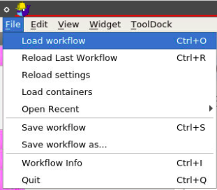

Select the workflow in directory **workflows/general/DICOM_Deidentification**

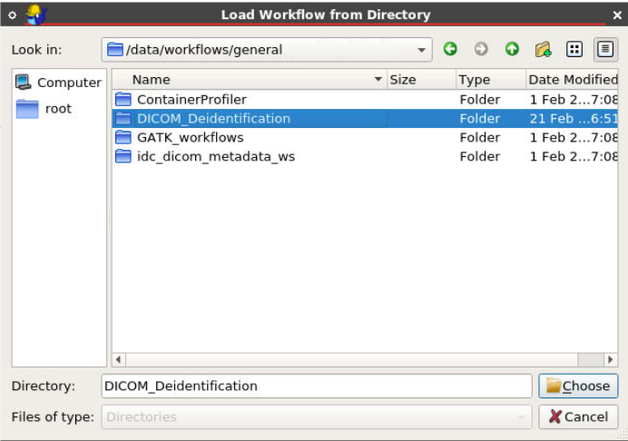

There are three widgets in DICOM De-identification workflow

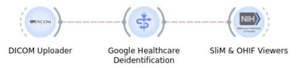

- **DICOM Uploader**: to upload DICOM images
	+ Credential File: the credential file that is generated from Google Cloud Platform (GCP) console. https://console.cloud.google.com/apis/credentials
	+ DICOM Directory: the directory includes DICOM images
	+ Bucket Name: the Google Storage bucket name that already created. https://console.cloud.google.com/storage/browser
	+ Project ID: the project ID associate with the GCP billing account. https://console.cloud.google.com/projectcreate
	+ Location: the location of the service. (default is us-central1)
	+ Dataset: the dataset. https://console.cloud.google.com/healthcare/browser
	+ DICOM Store: the DICOM store in a dataset.
- **Google Healthcare API (Deidentification)**: to specify the fields in DICOM images and execute the process of Deidentification through the API
	+ Credential File: the credential file that is generated from Google Cloud Platform (GCP) console. https://console.cloud.google.com/apis/credentials
	+ Project ID: the project ID associate with the GCP billing account. https://console.cloud.google.com/projectcreate
	+ Location: the location of the service. (default is us-central1)
	+ Dataset: the dataset. https://console.cloud.google.com/healthcare/browser
	+ Deidentified Dataset: specify name of the output deidentified dataset.
- **Slim & OHIF viewers**: to execute the Workflow Description Language (WDL) script
	+ Credential File: the credential file that is generated from Google Cloud Platform (GCP) console. https://console.cloud.google.com/apis/credentials
	+ Project ID: the project ID associate with the GCP billing account. https://console.cloud.google.com/projectcreate
	+ Location: the location of the service. (default is us-central1)
	+ Dataset: the dataset. https://console.cloud.google.com/healthcare/browser
	+ DICOM Store: the DICOM store in a dataset.
	+ Client ID: the authorized client application. https://github.com/varikmp/dicom_viewers/tree/documentation#setting-up-google-cloud

### Tutorials

1\. From the DICOM uploader widget, we need to select the credential file to allow the widget to operate the uploading. The DICOM directory should include the DICOM images and there is no particular level of sub-directories it holds. The Google Storage bucket name need to be specified to upload images to (They will be all deleted after transferring to the DICOM Store in the Dataset). Project ID, Location, Dataset, and DICOM Store are all information that we need to fill in for the purpose of this widget.

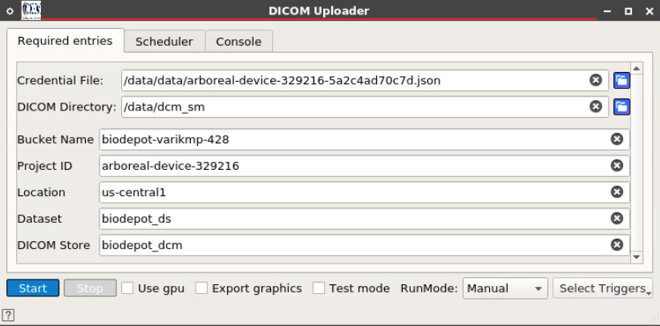

2\. The workflow directly transfer to Google Healthcare API widget after the previous one complete. Before putting this widget in progress, there will be a window popped up to ask user selects what DICOM fields the prefer to remove out of the metadata and images.

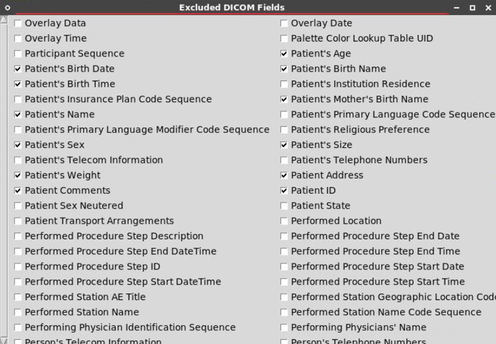

3\. We can also save the same DICOM field configuration to use for the next time by select the file in **optional entries** tab.

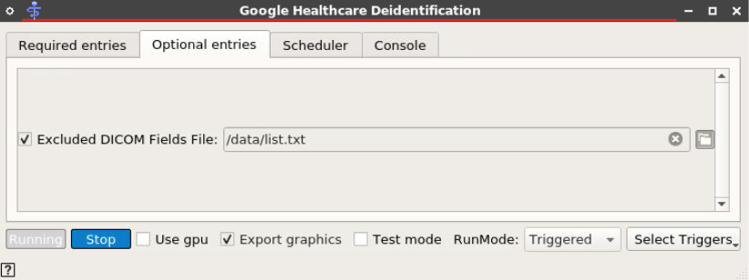

3\. The widget will automatically configure the settings and process the deidentification, and the screen should be similar as the picture shown below.

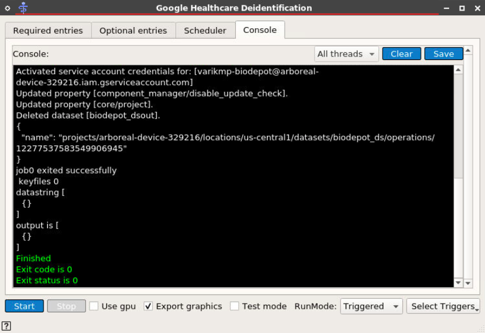

4\. The workflow again transfer to the last widget to display the uploaded and deidentified DICOM images over the viewers SliM (Slide Microscope) and OHIF (Open Health Imaging Foundation).

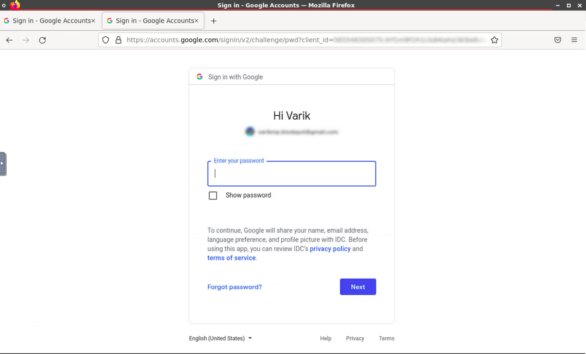

5\. After logging in successfully, we should be able to view the DICOM images with two options (2 tabs) SliM and OHIF as below.

Note: make sure that we already had the client app authorized by GCP before this step. https://github.com/varikmp/dicom_viewers/tree/documentation#setting-up-google-cloud

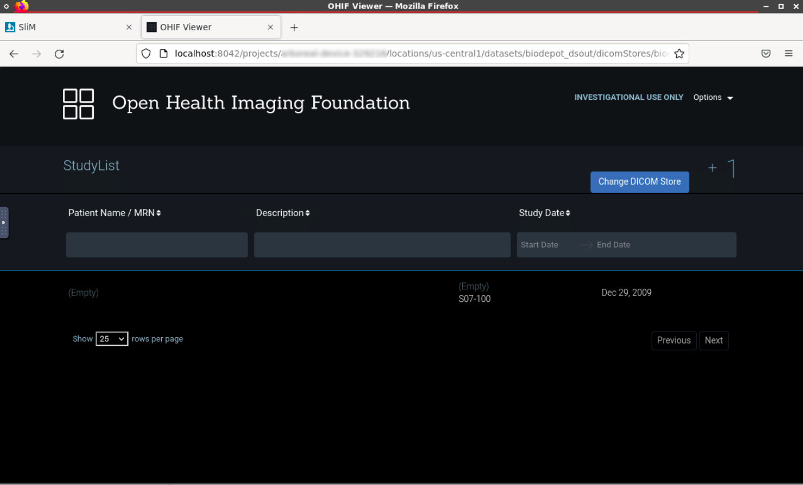

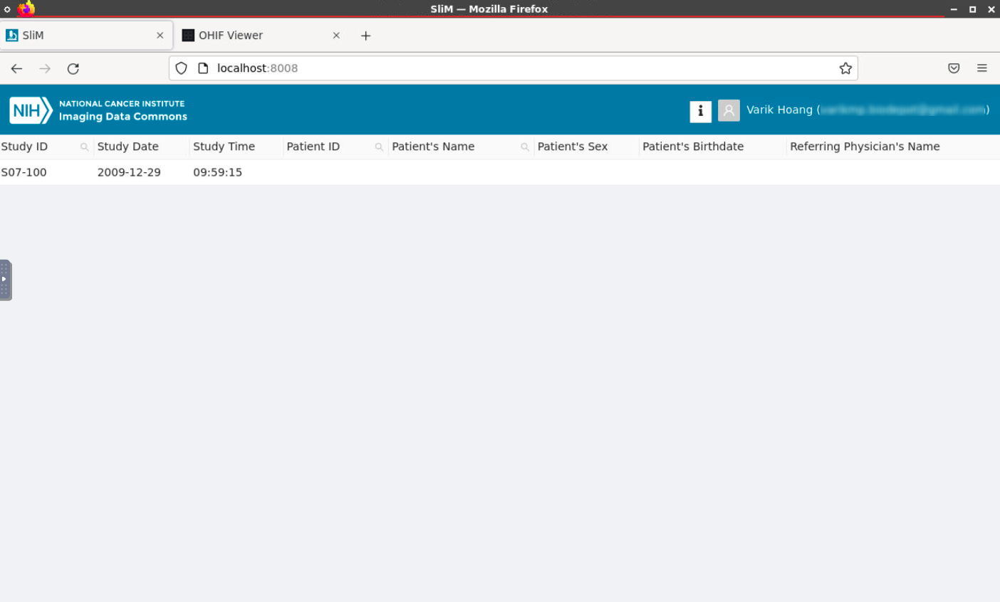

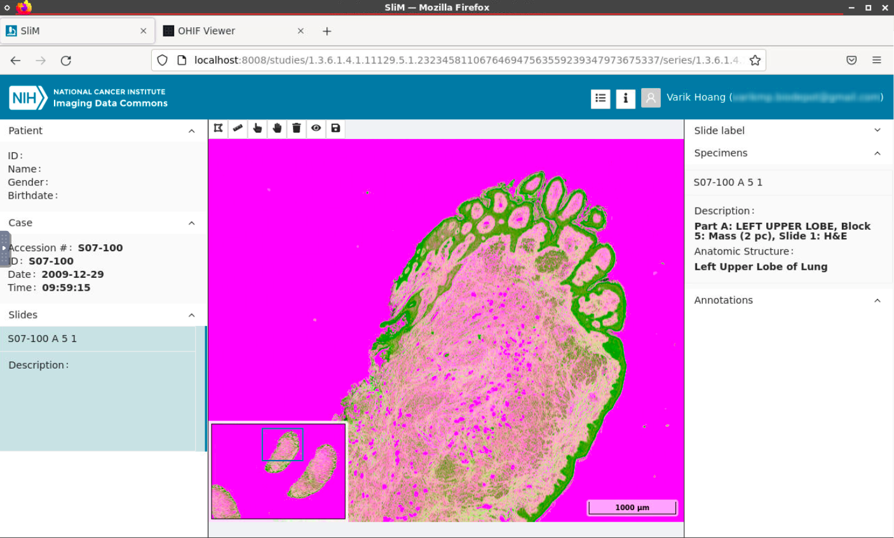

### Tutorial Video:

<a href="https://www.youtube.com/watch?v=KNEh_kGAl44&ab_channel=VarikHoang">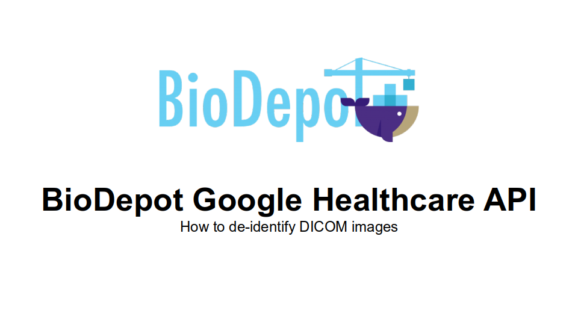</a>
