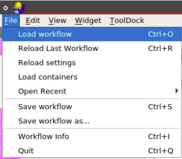
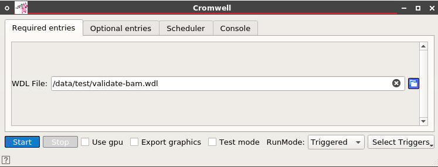

# Download Workflows from BioDepot-LLC Repository

- Use the Git command to clone the repository https://github.com/Biodepot-LLC/workflows
- Download the compressed file and then unzip the workflows.

On the menu bar, select **File** then **Load workflow**

Select the workflow in directory **workflows/general/GATK_workflows**

There are four widgets in generic GATK workflow

- Github: to download the workflow from the Git repository
	+ Repository URL: the URL of the Git repository
	+ Repository Directory: the directory that holds the workflow
- Data Localization: to download all GS files specifying in the JSON files to local machine
	+ Repository Directory: the directory that holds the workflow (**not editable**)
	+ Download Directory: the directory that holds all GS files downloaded
- Cromwell: to execute the Workflow Description Language (WDL) script
	+ WDL File: specify the WDL to execute
	+ JSON File: specify the object file (optional)
- Geany: to automatically open the result files generated after the execution
	+ Files: select predictive files generated from the execution

### Tutorials

1\. From the Github widget, we select the repository that can be found online. The sample we use here is from GATK workflow, to validate the format of the BAM file.

2\. The screen is shown as below after we successfully download the workflow from Git repository.

3\. The issue we may happen to see when the workflow provides the files from the cloud storage, so we need to download them to the local machine before executing the WDL script. We do not need to specify the repository directory in this widget because it is linked from the previous widget (Github). We only need to indicate the location to save the files from cloud storage.

4\. The widget will skip the files that are existed in the specified location, and here is the screen after finishing the downloading.

5\. Select the WDL script to execute the workflow in the **required entries**

6\. Also, some of WDL scripts may require to have data object file for the execution, so we need to go to the tab **Optional entries** to select the object file with extension **.tmp**, the one has already change from the GS URLs to local paths.

7\. After successfully executing the workflow, two report files generated from the widget 

8\. The geany widget should be automatically opening the results (**working on it**)

# Tutorial Video: (coming)

