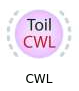
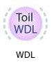
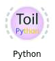
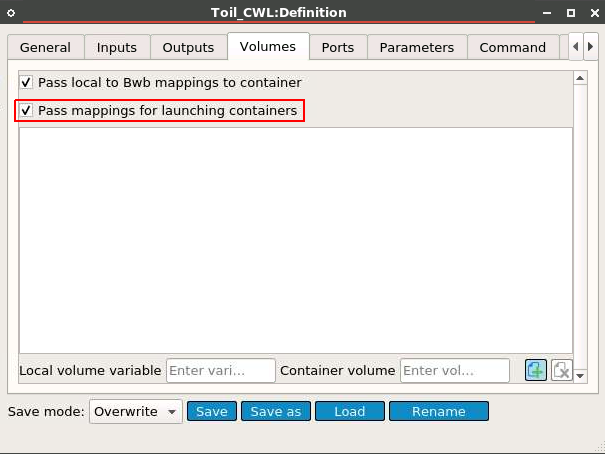
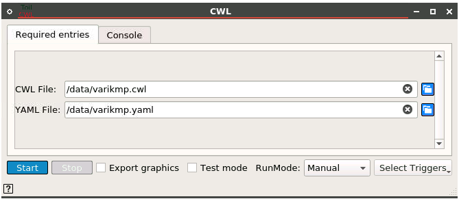
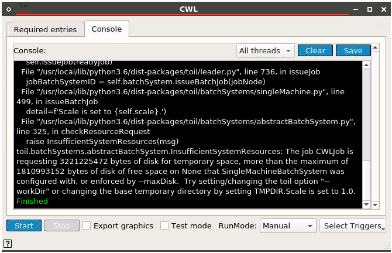
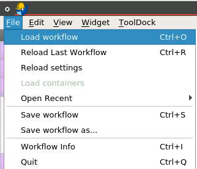
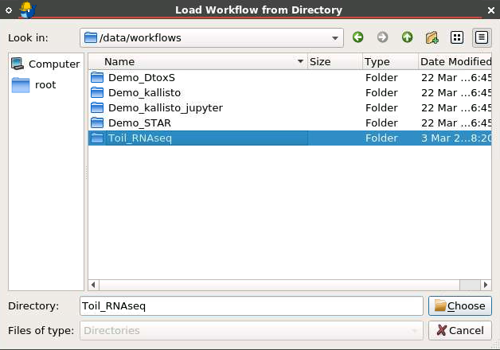
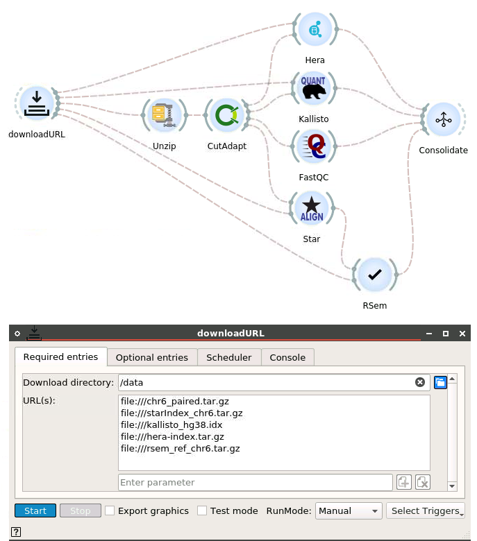

# How to use Toil widgets:

1\. There are three types of Toil widgets: Common Workflow Language (CWL), Workflow Description Language (WDL), and Basic Python-scripted Workflow. Here is the example of using Toil CWL widget. Click on the Toil CWL icon to create a Toil CWL/WDL/Python widget.

  

Edit the widget and select the tab "**Volume**". Make sure that option "**Pass mappings for launching containers**" checked. This step is to ensure that the Toil container will have the volume mapping to the **/var/run/docker.sock** directory from the host machine (we rely on the docker daemon on the host machine).

We now double-click on that widget to select **CWL file** along with the data file (**YAML file**)

When the console says "**Finished**" and returns the **exit code** and **exit status** both **zeroes**, that means you successfully executed the Toil CWL file without technical errors at different container levels. (nested containers)

# How to use Toil RNA_seq Workflow:

The structure of the RNA_seq workflow followed this source: https://github.com/BD2KGenomics/toil-rnaseq

1\. Load the workflow.

2\. Select the Toil RNA_seq workflow.

3\. Adjust the data input URLs.

The current files in the list are on local machine.

We can also change them to direct URLs to test the RNA_seq workflow as follow:

http://courtyard.gi.ucsc.edu/~jvivian/toil-rnaseq-inputs/continuous_integration/chr6_paired.tar.gz

http://courtyard.gi.ucsc.edu/~jvivian/toil-rnaseq-inputs/continuous_integration/starIndex_chr6.tar.gz

http://courtyard.gi.ucsc.edu/~jvivian/toil-rnaseq-inputs/kallisto_hg38.idx

http://courtyard.gi.ucsc.edu/~jvivian/toil-rnaseq-inputs/hera-index.tar.gz

http://courtyard.gi.ucsc.edu/~jvivian/toil-rnaseq-inputs/rsem_ref_hg38_no_alt.tar.gz

# Tutorial Video:

